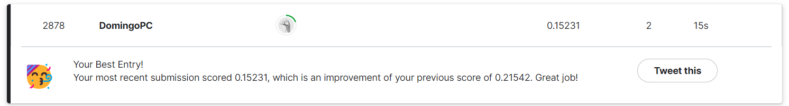

# 🧹 **Cleaning House Price Data in PySpark** 🏠

This project focuses on cleaning large quantities of data using **PySpark** to partition it. This is an essential task in every Data Science project as it not only improves the model performance, but it also helps on understanding variables and their reliability.

---

## 📂 Dataset

The dataset belongs to [this Kaggle competition](https://www.kaggle.com/c/house-prices-advanced-regression-techniques), and showcase house prices and several other characteristics, such as:
- 🏡**House measurements** (e.g., garage area, distance from the door to the street).
- ✨**Quality** (e.g., fireplace quality, garage quality).
- 🧰**Technical information** (e.g., access to gas, type of heating).
- 💰**Sale information** (e.g., year sold, sale type).

Data preprocessing involves:
- NAs Imputation.
- Outliers detection.
- Correlation and PCA to reduce dimensionality.
- One-Hot Encoding.
- Standarization.

---
## 🎯 Objective

To predict the sales price for each house, while minimizing the Root-Mean-Squared-Error (RMSE). Key goals include:
- Building and evaluating **advanced regression** techniques like random forest and gradient boosting.
- Performing **feature engineering** to improve models performance.
- Working with **PySpark** to work with partitioned data.

---

## ⚙️ Approach

### 🔄 Data Preparation
1. **Data Preprocessing Steps:**
   - Loaded and cleaned the dataset to remove missing values and inconsistencies.
   - Performed exploratory data analysis (EDA) to identify outliers.
   - Standarized numerical data and normalized features for consistent scaling.

2. **Feature Engineering:**
   - Extracted relevant features for analysis and modeling.
   - Applied transformations such as one-hot encoding.
     
### 🛠️ Models
- **Linear models:** linear regression, generalized linear model (GLM).
- **Tree Regression Models:** decission tree, random forest, gradient boosted trees.

---

## 🌟 Results

Using a GLM, it was possible to achieve the following results on Kaggle:

